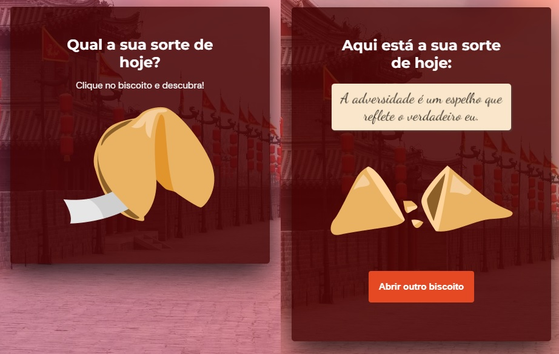

<h1 align="center"> Biscoito da Sorte | Fortune Cookie </h1>

## Projeto

O projeto consiste em sortear e mostrar uma "frase da sorte", no qual o usuário, a partir de um clique ou enter, abre um biscoito com a sua sorte do dia.

- Para acessar a página final da aplicação, [click here](https://hellenvelasques.github.io/fortune-cookie/).

  

## Tecnologias
- HTML
- CSS
- JavaScript

Projeto criado a partir de um desafio do Stage05 do Explorer da Rocketseat.
